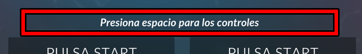
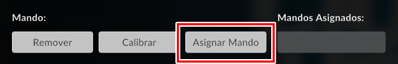
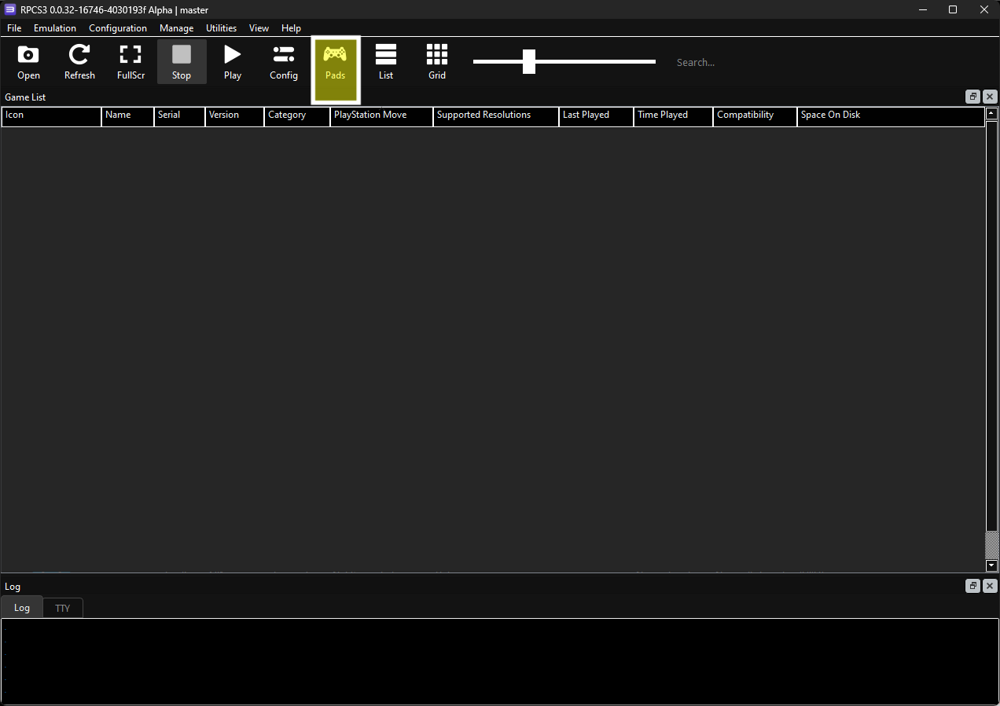
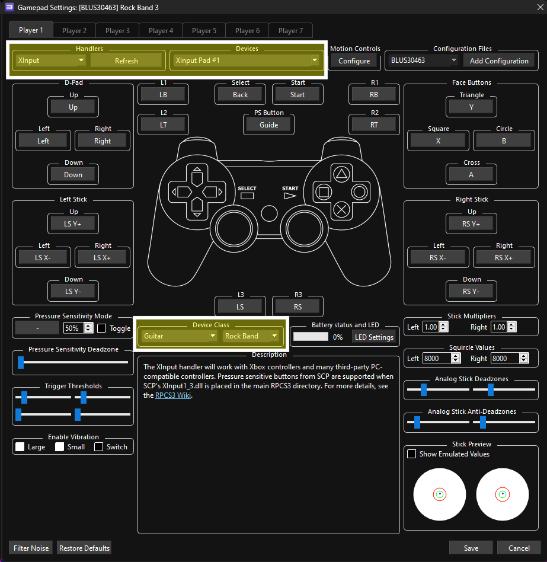

# RB4InstrumentMapper

Un programa que mapea y convierte datos de paquetes de instrumentos hechos para Xbox One hacía controles virtuales, para usar en juegos como [Clone Hero](https://clonehero.net/).

Todos los instrumentos de Xbox One funcionan (guitarras/baterías de RB4, guitarras de GHL), y también el adaptador de RB4 inalámbrico para instrumentos anteriores (RB4 Wireless Legacy Adapter.)

## Secciones

- [Instalación](#instalación)
  - [Configurando ViGEmBus](#configurando-vigembus)
  - [Configurando vJoy](#configurando-vjoy)
- [Usando guitarras y baterías de Rock Band 4](#usando-guitarras-y-bater%C3%ADas-de-rock-band-4)
  - [Configurando](#configurando)
    - [Stratocaster, Jaguar, Batería](#stratocaster-jaguar-bater%C3%ADa)
    - [Riffmaster](#riffmaster)
  - [Usando](#usando)
    - [¿Problemas emparejando?](#problemas-emparejando)
- [Usando guitarras de Guitar Hero Live o el adaptador de RB4 inalámbrico para instrumentos anteriores](#usando-guitarras-de-guitar-hero-live-o-el-adaptador-de-rb4-inal%C3%A1mbrico-para-instrumentos-anteriores-rb4-wireless-legacy-adapter)
  - [Configurando](#configurando-1)
  - [Usando](#usando-1)
- [Configurando los Controles](#configurando-tus-instrumentos)
  - [Clone Hero](#clone-hero)
  - [YARG](#yarg)
  - [GHWT: Definitive Edition](#ghwt-definitive-edition)
  - [RPCS3](#rpcs3)
- [Registro de Paquetes](#registro-de-paquetes)
- [Registro de Errores](#registro-de-errores)
- [Construyendo](#construyendo)
- [Referencias](#referencias)
- [Licencia](#licencia)

## Instalación

1. Descarga y instala RB4InstrumentMapper de [la pagina de pagina de publicaciones (Releases)](https://github.com/TheNathannator/RB4InstrumentMapper/releases).
2. Descarga y configura [ViGEmBus](https://github.com/ViGEm/ViGEmBus/releases/latest) o [vJoy](https://github.com/jshafer817/vJoy/releases/latest) usando las guías abajo.
   - ViGEmBus es recomendado porque es mas fácil para usar y no requiere configuración adicional. vJoy es una opcion alternativa por si tienes problemas con ViGEmBus.
   - Los dos se pueden instalar al mismo tiempo, pero RB4InstrumentMapper solo va usar uno.

### Configurando ViGEmBus

1. Descarga y instala [ViGEmBus](https://github.com/ViGEm/ViGEmBus/releases/latest).
2. ¡Eso es todo!

### Configurando vJoy

1. Descarga y instala [vJoy](https://github.com/jshafer817/vJoy/releases/latest).
2. Después de descargar, abre el menú de Inicio, busca la carpeta llamada `vJoy` y abre `Configure vJoy` dentro de esa carpeta.
3. Configura un dispositivo (Device) para cada uno de tus instrumentos usando estas opciones:
   - [Number of Buttons](# Numero de botones): 16
   - [POV Hat Switch: Continuous, POVs](# Switch de PDV: Seguido, PDVs): 1
   - Axes: `X`, `Y`, `Z`

   

4. Click Apply.
4. Haz click en [Apply](# Aplicar)
5. ¡Eso es todo!

---

## Usando guitarras y baterías de Rock Band 4

*Toma en cuenta que RB4InstrumentMapper NO esta requerido para usar guitarras en Fortnite*

### Configurando

#### Stratocaster, Jaguar, Batería

Para usar guitarras y baterías inalámbrica de Rock Band 4, vas a necesitar un receptor para controles inalámbricos de Xbox One. Las dos versiones oficiales se ven asi:

- ¡*No* son iguales a los receptores inalámbricos de Xbox 360! Tienes que tener un receptor para controles inalámbricos de Xbox One (o solo "Xbox"), como los ejemplos arriba.
- Los receptores que no son originales no están probados y no recibirán soporte técnico.

Adicionalmente, las guitarras Jaguar  requieren una actualizacion de firmware para conectarse a receptores para controles inalámbricos de Xbox One.

- [Instrucciones (Ingles)](https://bit.ly/2UHzonU)
- [Recargo de la Wiki de Clone Hero](https://wiki.clonehero.net/link/61), en caso de que el enlace de arriba caiga otra vez.

#### Riffmaster

Para usar la Riffmaster, vas a necesitar su receptor dedicado, en la foto abajo:

### Usando

1. En el menú desplegable de [`Controller Emulation Mode`](# Modo de emulación de control), selecciona el modo de emulación que quieres usar.

   

2. Haz click en el botón de [`Start`](# Iniciar) para empezar a leer datos que va a mandar tu instrumento.
3. Conecta tus instrumentos. Van estar detectados y funcionando hasta que presiones el botón de [`Stop`](# Parar) o cierres el programa.
   - Los instrumentos deben de estar conectados antes o despues de presionar el botón de [`Start`](# Iniciar), la orden no importa.
4. [Configura tus instrumentos en los juegos en los que los vas a usar](#mapping-your-controls)

#### ¿Problemas emparejando?

Es posible que guitarras/baterías no se emparejan correctamente solo usando el botón de emparejar. Esto incluye la batería de PDP y la guitarra Jaguar en ocasión. Sigue estos pasos para emparejar tu instrumento correctamente:
1. Entra a `Configuración` de Windows > `Dispositivos` > `Bluetooth y otros dispositivos`
2. Haz click en `Agregar Bluetooth u otro dispositivo` y elije `Otro`.
3. Presiona y sostén el botón de emparejar hasta que el botón de Xbox parpadee rapido.
4. Elije [`Xbox compatible game controller`](# Control de juego compatible con Xbox) de la lista cuando aparezca.
5. Si eso no funciona, reinicia tu computadora y trata otra vez.

---

## Usando guitarras de Guitar Hero Live o el adaptador de RB4 inalámbrico para instrumentos anteriores (RB4 Wireless Legacy Adapter)

### Configurando

Vas a necesitar instalar el controlador de WinUSB al receptor de Guitar Hero Live o el adaptador de RB4 inalámbrico para instrumentos anteriores (RB4 Wireless Legacy Adapter) antes de usarlos. Es posible usar RB4InstrumentMapper para instalarlo directamente, por el menú de [`Configure Devices`](# Configurar Dispositivos) en su menú principal:

1. Activa la opción [`Enable`](# Activar) bajo el grupo de `USB`, y luego haz click en [`Configure Devices`](# Configurar Dispositivos) abajo de eso.

   

2. Encuentra el dispositivo que quieres usar en el menú del lado izquierdo.
   
   

3. Haz click en [`Switch Driver`](# Cambiar Controlador) y espera para que se cambie el controlador. El dispositivo que estas modificando va a salir en el lado derecho cuando se complete esto.
   
   

   - Por favor toma en cuenta que cualquier juego que tenga soporte directo para estos dispositivos no va funcionar hasta que borres el controlador de WinUSB. Haz click en el botón de [`Revert Driver`](# Revertir Controlador) para revertir tus cambios para poder usar el dispositivo directamente.

Si tienes problemas con esta instalación, puedes tratar [instalar el controlador manualmente (en Ingles)](Docs/WinUSB/manual-winusb-install.md). Esto no es recomendando paro mayoría de los usuarios. Solo se debe usar esta alternativa si el menú de [`Configure Devices`](# Configurar Dispositivos) no funciona.
- Esto también describe como [desinstalar manualmente (en Ingles)](Docs/WinUSB/manual-winusb-install.md#remove-winusb), en caso de que el dispositivo se quede con el controlador atorado y RB4InstrumentMapper para de detectarlo.

### Usando

1. Activa la opción [`Enable`](# Activar) bajo el grupo de `USB`.

   

2. **¡Asegúrate que instalaste [el controlador de WinUSB](url) en los dispositivos que quieres usar! ¡No serán detectados si no esta hecho!**
3. En el menú desplegable de [`Controller Emulation Mode`](# Modo de emulación de control), selecciona el modo de emulación que quieres usar.

   

4. Haz click en el botón de [`Start`](# Iniciar) para empezar a leer datos que va a mandar tu instrumento.
5. [Configura tus instrumentos en los juegos en los que los vas a usar](#mapping-your-controls).

Se va a detectar si instrumentos se conectan/desconectan automáticamente, pero no se van a mandar datos a los juegos hasta que presiones el botón de [`Start`](# Iniciar).

Si tienes problemas con como se mandan los botones presiones o otras cosas raras, puedes tratar de desconectar y reconectar el receptor/cable. Desafortunadamente, la detección de estos dos tipos de dispositivos no esta completamente estable, así que es posible que no funcione perfectamente.

---

## Configurando Tus Instrumentos

Ahora que RB4InstrumentMapper esta listo y corriendo, puedes configurar los controles de tus instrumentos en los juegos que vas a jugar. 

### Clone Hero

Si estas usando una guitarra en el modo ViGEmBus, Clone Hero va a mapear todo automáticamente. No debes de tener que hacer ajustes manuales, al menos que estés usando una guitarra de Guitar Hero Live. En ese caso, vas a necesitar cambiar la configuración de [Whammy](# Palanca de tremolo) y de ladear.

- La configuración automática también se va a aplicar a baterías, pero no va estar correcta porque esta diseñada para guitarras. Vas a necesitar cambiar la configuración que esta por defecto y ajustarla manualmente.

Para baterias, modo vJoy, o si necesitas ajustar tus controles por otra razón: 

1. Presiona espacio en el menú principal.

   

2. Haz click en Asignar Mando y presiona un botón para que se asigne.

   

3. Haz click en las ranuras bajo la sección de `Mando` para mapear todo cada control.

   

4. Repite para cada instrumento.
5. Haz click en `Listo`.

Si requieres mas ayuda mapeando tu instrumento, puedes preguntar por ayuda en [el Discord de Clone Hero](https://discord.gg/Hsn4Cgu).

### YARG

Consulta la [documentación oficial (en Ingles)](https://docs.yarg.in/en/profiles).

### GHWT: Definitive Edition

Consulta la [documentación oficial (en Ingles)](https://ghwt.de/wiki/#/wtde/binding?id=binding-controllers).

### RPCS3

1. Para usar en RPCS3, usa la opción de [`ViGEmBus (RPCS3 compatibility)`](# ViGEmBus (Compatibilidad para RPCS3) bajo el menú desplegable de [`Controller Emulation Mode`](# Modo de emulación de control). Eso hace que RB4InstrumentMapper mande sus datos de tus instrumentos al emulador en una forma que no requiere hacer ajustes (o ajustes mínimos) en el emulador de RPCS3.

   

2. Haz click en [Gamepad Configuration Menu](# Menú de configuración de mandos) en RPCS3.

   

3. Cambiar [`Handlers`](# Manipuladores) a "XInput", selecciona tu instrumento bajo [`Devices`](# Dispositivos), y cambia [`Device Class`](# Clase de dispositivo) a "Rock Band - Guitar" si estas usando una guitarra o 'Rock Band - Drums' si estas usando una batería.

   

4. Repite para cada instrumento en las pestañas de [Player](# Jugador).
5. Haz click en `Listo`.

## Registro de Paquetes

Se puede usar RB4InstrumentMapper para registrar datos a un archivo para razones de depuración. Para hacer esto, activa [`Show Packets (for debugging)`](# Mostrar Paquetes (para depuración)) y [`Log packets to file`](# Registrar datos a archivo) y luego haz click en el botón de [`Start`](# Iniciar). Los datos de van a guardar en tu carpeta de Documentos. Asegúrate de incluirla cuando preguntes por ayuda o creas reportes de problemas con la interpretación de datos.

Toma en cuenta que estas opciones son solo para depurar. Dejándolas activadas puede causar problemas con el rendimiento del programa.

## Registro de Errores

En el caso de que programa falle, el error se va a registrar en un archivo dentro de la carpeta `RB4InstrumentMapper` > `Logs` que va estar localizada en la carpeta de tus Documentos. Asegúrate de incluirla cuando preguntes por ayuda o creas reportes de problemas con el programa.

## Construyendo

Para construir este programa, vas a necesitar:

- Visual Studio, o MSBuild/[es SDK de .NET](https://dotnet.microsoft.com/es-es/download) + tu editor de código preferido.
- [WiX Toolset v4](https://wixtoolset.org/) si quieres construir el instalador.

## Referencias

Antecesores:

- [Repositorio de GuitarSniffer](https://github.com/artman41/guitarsniffer)
- [Repositorio de DrumSniffer](https://github.com/Dunkalunk/guitarsniffer)

Datos de paquetes:

- [Registros de paquetes de guitarra por GuitarSniffer(https://1drv.ms/f/s!AgQGk0OeTMLwhA-uDO9IQHEHqGhv)
- Hoja de datos de paquetes para guitarras de GuitarSniffer: [Nuevos](https://docs.google.com/spreadsheets/d/1ITZUvRniGpfS_HV_rBpSwlDdGukc3GC1CeOe7SavQBo/edit?usp=sharing), [Viejos](https://1drv.ms/x/s!AgQGk0OeTMLwg3GBDXFUC3Erj4Wb)
- [Codigo fuente de Javascript de rb4.app](https://rb4.app/js/app.js)
- Investigación original, publicada en el [repositorio de documentación PlasticBand](https://github.com/TheNathannator/PlasticBand).

## Licencia

Este programa esta publicado con la licencia de MIT. Lee [LICENSIA (en Ingles)](LICENSE) para mas información.
